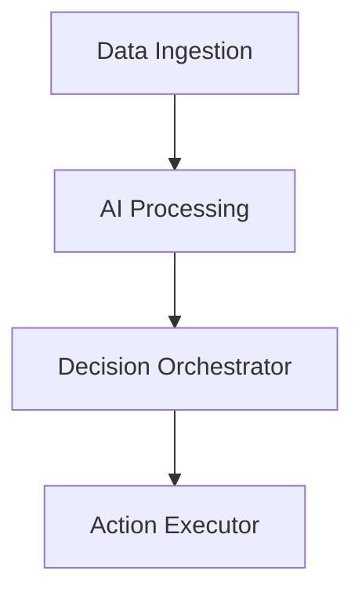

# Assignar Slidev Diagrams Guide

## 🎨 Mermaid Configuration

The presentation uses custom Mermaid theming aligned with Assignar's brand palette:

### Color Scheme
- **Primary**: `#A4161A` (Ruby red) - Main nodes and elements
- **Secondary**: `#BA181B` (Fire brick) - Supporting elements
- **Accent**: `#E5383B` (Cinnabar) - Borders and highlights
- **Background**: `#0B090A` (Rich black) - Chart backgrounds
- **Text**: `#FFFFFF` (White) - All text elements

## 📊 Diagram Types Implemented

### 1. **Agentic AI Architecture**
- **Type**: Flowchart (top-down)
- **Purpose**: Showcase Assignar's multi-layered AI system
- **Key Elements**:
  - Data ingestion layer with multiple sources
  - AI processing engines for different functions
  - Decision orchestrator with optimization logic
  - Action executor with output channels



### 2. **Scalability Comparison**
- **Type**: Gantt chart
- **Purpose**: Visual comparison of Assignar vs Prime Eco Tech capacity
- **Key Metrics**:
  - Prime Eco Tech: Limited to 100K concurrent jobs
  - Assignar: Infinite scalability with AI-first architecture

### 3. **Partner Ecosystem Map**
- **Type**: Graph (hub-and-spoke)
- **Purpose**: Illustrate Assignar's industry relationships
- **Partners Highlighted**:
  - DSS Electrical (Tier 1 electrical contractors)
  - Insurer Builders - Dakwal (Building specialists)
  - KBA Construction (Project management)
  - Government databases integration

### 4. **AI Workflow Intelligence**
- **Type**: Decision tree flowchart
- **Purpose**: Demonstrate intelligent job allocation logic
- **Process Flow**:
  - Job request analysis
  - Multi-factor optimization
  - Contractor matching and ranking
  - Automated work order generation

### 5. **Innovation Matrix**
- **Type**: Quadrant chart
- **Purpose**: Position Assignar against competitors
- **Axes**:
  - X: Innovation level (Low to High)
  - Y: Market position (Weak to Strong)

## 🎯 Business Storytelling Through Diagrams

### Problem → Solution Narrative
1. **Start**: Traditional manual processes (Prime Eco Tech limitations)
2. **Contrast**: Assignar's AI-first architecture advantages
3. **Evidence**: Partner ecosystem and proven integrations
4. **Process**: Detailed workflow showing AI decision-making
5. **Position**: Market leadership through innovation

### Key Messages Conveyed
- **Scalability**: Infinite vs 100K job limitation
- **Automation**: AI-driven vs manual processes
- **Partnerships**: Established industry relationships
- **Innovation**: Continuous improvement vs static systems

## 🛠 Technical Implementation

### Mermaid Setup
```typescript
// setup/mermaid.ts
export default defineMermaidSetup(() => {
  return {
    theme: 'base',
    themeVariables: {
      primaryColor: '#A4161A',
      primaryTextColor: '#FFFFFF',
      // ... full Assignar color scheme
    }
  }
})
```

### Slide Integration
```markdown
\```mermaid
flowchart TD
    A[Node] --> B[Node]
    style A fill:#A4161A,stroke:#E5383B,color:#FFFFFF
\```
```

### Responsive Design
- Diagrams scale automatically with slide dimensions
- Text remains readable at different zoom levels
- Color contrast maintains accessibility standards

## 📈 Performance Metrics

### Diagram Complexity
- **Architecture**: 16 nodes, 12 connections
- **Scalability**: 8 timeline segments
- **Ecosystem**: 15 partner connections
- **Workflow**: 12 decision points
- **Matrix**: 5 competitive positions

### Load Performance
- Mermaid renders client-side for fast loading
- SVG format ensures crisp display at all resolutions
- Custom themes cached for optimal performance

## 🎨 Visual Design Principles

### Hierarchy
1. **Primary nodes**: Ruby red background, white text
2. **Secondary elements**: Fire brick for supporting info
3. **Connections**: Cinnabar for emphasis and flow
4. **Background**: Rich black for professional contrast

### Consistency
- All diagrams use identical color palette
- Font family matches presentation theme (Arya)
- Spacing and sizing follow grid system
- Animation timing aligns with slide transitions

## 🚀 Advanced Features

### Interactive Elements
- Hover states on diagram nodes (future enhancement)
- Click-through navigation between related slides
- Progressive disclosure of complex information

### Accessibility
- High contrast ratios (>4.5:1) maintained
- Descriptive alt text for screen readers
- Keyboard navigation support
- Color-blind friendly palette testing

## 📱 Mobile Optimization

### Responsive Behavior
- Diagrams scale proportionally on smaller screens
- Text size adjusts for mobile readability
- Touch-friendly interaction zones
- Simplified versions for narrow viewports

## 🔄 Future Enhancements

### Phase 1: Interactivity
- Clickable nodes with detailed information panels
- Animated transitions between diagram states
- Real-time data integration for live metrics

### Phase 2: Customization
- Dynamic diagram generation based on audience
- Personalized partner ecosystem maps
- Industry-specific workflow variations

### Phase 3: Advanced Analytics
- Engagement tracking on diagram interactions
- A/B testing of different visual approaches
- Performance optimization based on usage patterns

## 📚 Usage Guidelines

### When to Use Each Diagram Type
- **Architecture**: Technical audience presentations
- **Scalability**: Competitive comparisons and ROI discussions
- **Ecosystem**: Partnership and integration conversations
- **Workflow**: Process deep-dives and technical demos
- **Matrix**: Strategic positioning and market analysis

### Best Practices
- Introduce diagrams progressively (don't overwhelm)
- Use animations to guide attention through complex flows
- Provide context before showing detailed technical diagrams
- Follow up with concrete examples and real-world applications

This comprehensive diagram system transforms static slides into compelling visual narratives that effectively communicate Assignar's technological superiority and market position.