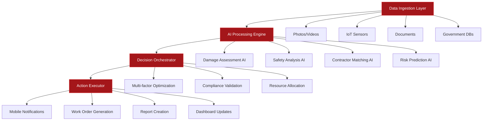
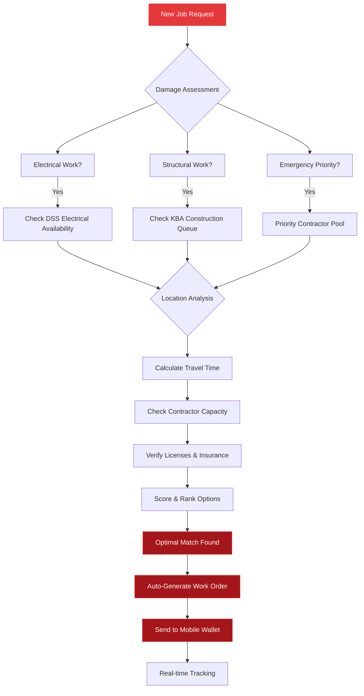
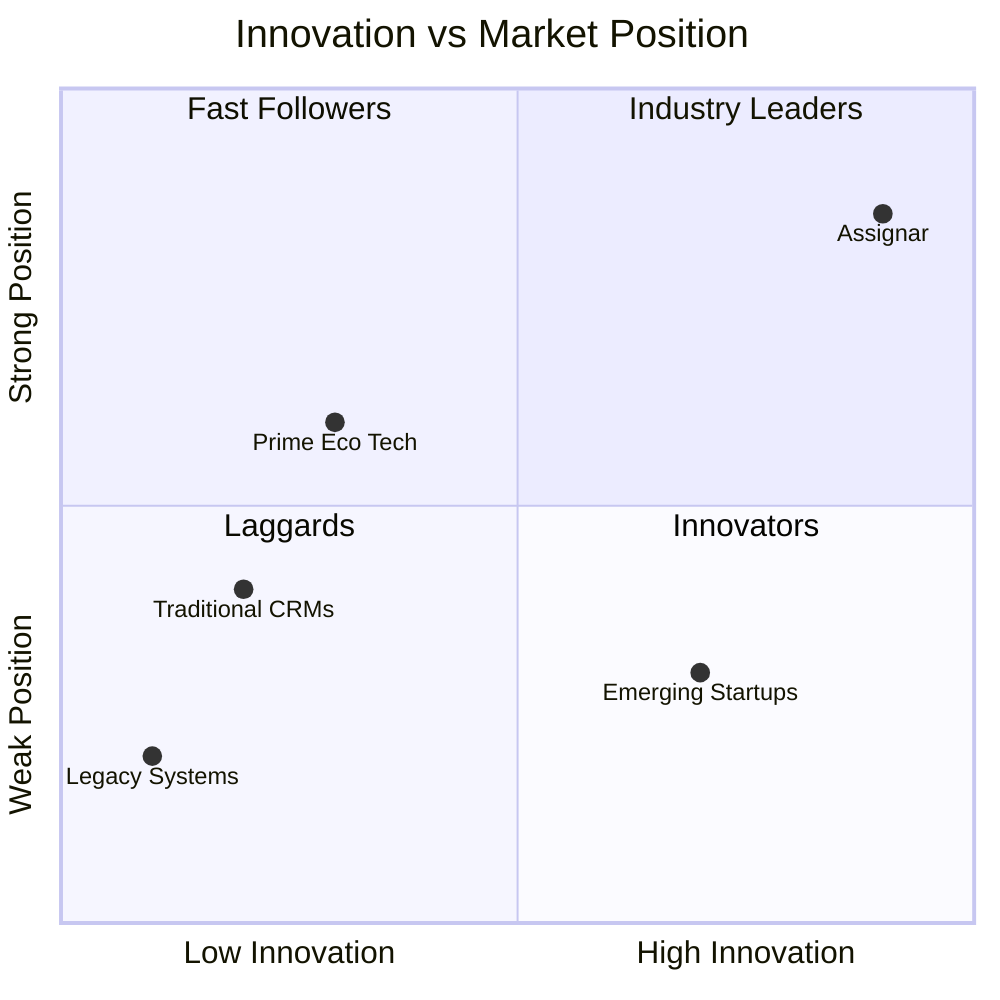

# Assigner

## **AI-Driven Platform for Australian Insurance & Construction**

Streamlining damage assessment, job allocation, safety, and compliance

  

    Get Started <carbon:arrow-right class="inline ml-2"/>
  

---
layout: default
class: animate-fade-up
---

# The Problem

Current insurance and construction processes are **critically inefficient**

## Key Pain Points

- 🐌 **Manual processes** lead to slow job allocation and repair turnaround
- 📄 **Poor documentation** creates insurance claim delays
- ⚠️ **Safety compliance** relies on outdated or generic templates
- 🔍 **Contractor verification** is inconsistent and time-consuming

70%

of claims experience delays

---
layout: default
class: animate-slide-in
---

# Smart Damage Assessment

## **AI-powered documentation in seconds**

- 📸 Homeowners or assessors capture photos/videos of storm or damage events
- 🧠 AI analyses and tags structural, electrical, and hazardous elements
- 📋 Standardised and thorough digital documentation created automatically

40%+

improvement in claim accuracy

### **Key Benefits**

✅ **Instant Analysis** - Real-time damage assessment

✅ **Standardized Reports** - Consistent documentation format

✅ **Hazard Detection** - Automated safety risk identification

✅ **Accelerated Processing** - Faster insurance approvals

---
layout: default
class: animate-fade-up
---

# Intelligent Contractor Dispatch

## **Smart job allocation powered by AI**

### **AI Allocation Factors**

🔧 **Required trades** (e.g., roofing, electrical)

📜 **Valid licenses and insurances**

📍 **Location and project queue availability**

⏱️ **Contractor capacity and timeline**

70%

reduction in admin overhead

3x

faster job allocation

---
layout: default
class: animate-slide-in
---

# Dynamic SWMS & Reporting

## **Automated safety compliance**

AI-generated SWMS tailored to:

- ⚒️ **Job type** requirements
- 🏗️ **Site conditions** (e.g., asbestos risk)
- 📊 **Public datasets** and safety standards
- 🎯 **Real-time hazard detection**

### **Smart Features**

🎮 **Gamified Experience**

Engaging onsite reporting for tradies

⚖️ **Legal Compliance**

Automated form creation and validation

📱 **Mobile-First Design**

Easy field data capture

🔔 **Real-time Alerts**

Instant safety notifications

---
layout: default
class: animate-fade-up
---

# Licensing & Insurance Compliance

## **Automated credential verification**

### **Integration Points**

🏛️ Connects to **government databases** & Digital ID systems

✅ Ensures contractor credentials are verified and current

🔔 Automated expiry reminders and simple onboarding flow

🛡️ **Improves trust and risk management** in the supply chain

### **Trust Metrics**

100%

credential verification

24/7

compliance monitoring

0

manual verification steps

---
layout: default
class: animate-slide-in
---

# Smart Wallet & Work Orders

## **Seamless job deployment**

Leverages **Google/Apple Wallet** for instant job deployment

Contractors receive a digital work order with:

- 📋 **Scope of work**
- 🦺 **Safety documentation**
- 📅 **Calendar sync**
- 📍 **Location details**
- 💬 **Direct communication**

### **Mobile-First Benefits**

📱 **Instant Access**

Work orders available immediately

🔄 **Real-time Updates**

Live status and progress tracking

🎯 **Transparency**

Clear expectations and deliverables

⚡ **Adoption**

Familiar wallet interface

---
layout: default
class: animate-fade-up
---

# Agentic AI Architecture

## **Assignar's Intelligence Stack**

Multi-layered AI system with **autonomous decision-making**:

- 🧠 **Proprietary AI Models**
- ⚡ **Real-time Processing**
- 🔄 **Continuous Learning**
- 🛡️ **Built-in Safety Guards**

**Key Differentiators:**

✅ **Self-optimizing** job allocation

✅ **Predictive** maintenance scheduling

✅ **Autonomous** compliance monitoring

---
layout: default
class: animate-slide-in
---

# Scalability: Assignar vs Prime Eco Tech

```mermaid
gantt
    title Concurrent Job Capacity Comparison
    dateFormat X
    axisFormat %s

    section Prime Eco Tech
    Manual Processes           :done, primemanual, 0, 20000
    CRM Bottlenecks           :done, primecrm, 20000, 50000
    System Strain             :crit, primestrain, 50000, 80000
    Failure Point             :crit, primefail, 80000, 100000

    section Assignar
    AI-First Architecture     :active, assignarbase, 0, 100000
    Distributed Processing    :assignardist, 100000, 500000
    Infinite Scalability      :assignarinf, 500000, 1000000
```

### **Prime Eco Tech Limitations**

❌ **Manual bottlenecks** at 50K+ jobs

❌ **Admin overhead** increases exponentially

❌ **System crashes** beyond 100K concurrent

❌ **Single-tenant** architecture constraints

100K

maximum concurrent jobs

### **Assignar Advantages**

✅ **AI automation** eliminates bottlenecks

✅ **Microservices** enable infinite scaling

✅ **Real-time processing** maintains performance

✅ **Multi-tenant** cloud-native design

∞

scalable concurrent jobs

---
layout: default
class: animate-fade-up
---

# Industry Partner Ecosystem

```mermaid
graph TB
    A[Assignar Platform] --> B[DSS Electrical]
    A --> C[Insurer Builders - Dakwal]
    A --> D[KBA Construction]
    A --> E[Government Databases]
    A --> F[Insurance Providers]

    B --> B1[Licensed Electricians]
    B --> B2[Safety Certifications]
    B --> B3[Work History Data]

    C --> C1[Building Specialists]
    C --> C2[Insurance Claims]
    C --> C3[Quality Assurance]

    D --> D1[Project Management]
    D --> D2[Resource Allocation]
    D --> D3[Compliance Tracking]

    E --> E1[Contractor Licenses]
    E --> E2[Safety Records]
    E --> E3[Regulatory Updates]

    F --> F1[Claim Processing]
    F --> F2[Risk Assessment]
    F --> F3[Payout Approval]

    style A fill:#A4161A,stroke:#E5383B,color:#FFFFFF,stroke-width:4px
    style B fill:#BA181B,stroke:#E5383B,color:#FFFFFF
    style C fill:#BA181B,stroke:#E5383B,color:#FFFFFF
    style D fill:#BA181B,stroke:#E5383B,color:#FFFFFF
    style E fill:#660708,stroke:#E5383B,color:#FFFFFF
    style F fill:#660708,stroke:#E5383B,color:#FFFFFF
```

### **Tier 1 Partners**

🔌 **DSS Electrical** - Premium electrical contractors

🏗️ **Insurer Builders - Dakwal** - Specialized building restoration

⚙️ **KBA Construction** - Large-scale project management

3,500+

verified contractors

### **Trust Network Benefits**

✅ **Instant verification** through integrated systems

✅ **Quality assurance** via partner networks

✅ **Competitive rates** through volume partnerships

✅ **24/7 availability** across Australian markets

100%

credential verification

---
layout: default
class: animate-slide-in
---

# AI Workflow Intelligence

## **Intelligent Decision Tree**

AI-powered job allocation with **multi-factor optimization**:

- 🎯 **Skills matching** accuracy
- 📍 **Location optimization**
- ⏰ **Capacity management**
- 🏆 **Quality scoring**
- 💰 **Cost efficiency**

**Continuous Improvement:**

📈 **Machine learning** from every completed job

🔄 **Feedback loops** improve future allocations

🎯 **Precision increases** with system usage

---
layout: default
class: animate-fade-up
---

# Competitive Innovation Matrix

### **Innovation Velocity**

12x

faster feature development

24/7

continuous AI model training

∞

scalability advantage

### **Market Differentiation**

🚀 **Proprietary AI models** vs generic solutions

🔬 **R&D investment** in construction-specific AI

🤝 **Industry partnerships** for data advantage

🌐 **Australian-first** regulatory compliance

📱 **Mobile-native** user experience

---
layout: center
class: text-center animate-fade-up
---

# Industry Impact

### **Transformation Metrics**

30-50%

faster insurance-to-repair lifecycle

100%

improved safety compliance

∞

scalability for major insurers

## **Next Steps**

Seeking **pilot partners** to trial Assigner across storm response zones

**Let's innovate and transform claims management together**

